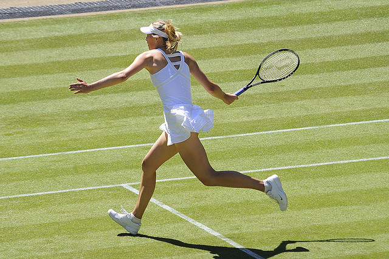
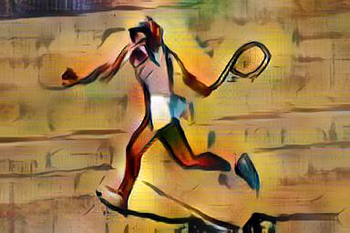
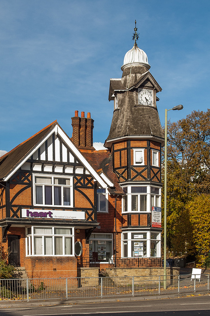
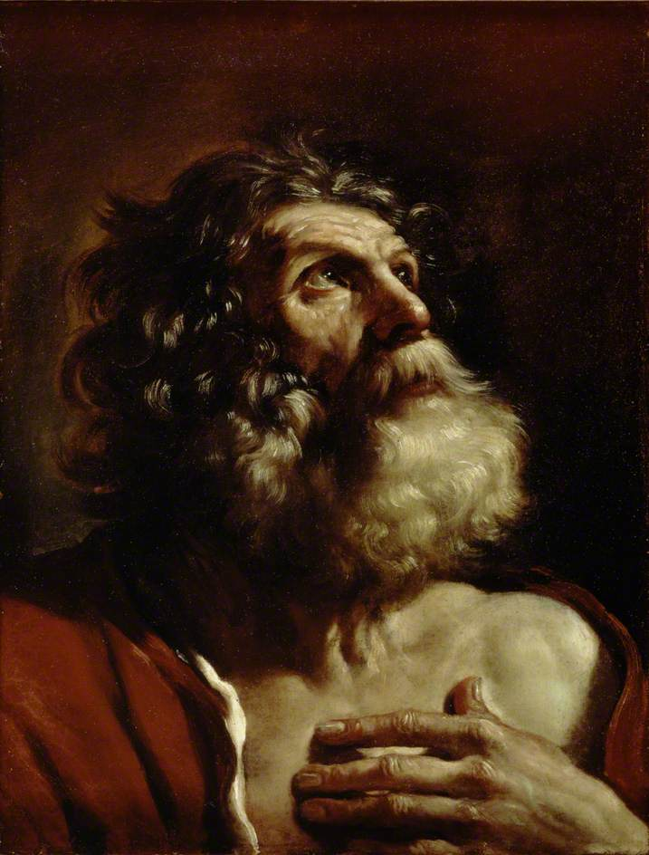
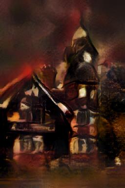

# Neural Style Transfer (AdaIN)

A PyTorch implementation of arbitrary style transfer using Adaptive Instance
Normalization (AdaIN), trained from scratch, with a Flask web app for trying
it out on your own images.

Given a **content image** and a **style image**, the model produces a new
image that keeps the content's structure but adopts the style's colors,
textures, and brushwork — all in a single forward pass, with no per-image
optimization required.

## Demo

| Content | Style | Output |
|---|---|---|
|  |  |  |
|  |  |  |

## How it works

The approach follows [*Arbitrary Style Transfer in Real-time with Adaptive
Instance Normalization*](https://arxiv.org/abs/1703.06868) (Huang & Belongie,
2017):

1. A pretrained, fixed **VGG encoder** extracts feature maps from both the
   content and style images.
2. **AdaIN** aligns the channel-wise mean and standard deviation of the
   content features to match the style features — this single normalization
   step transfers the style statistics.
3. A trainable **decoder** (the mirror of the encoder) reconstructs an image
   from the stylized features.
4. Only the decoder is trained — the encoder stays frozen — using a
   combination of content loss and style loss computed from VGG features.

A `alpha` parameter blends between the original content and the fully
stylized output, giving control over style strength.

## Project structure

```
.
├── app.py                # Flask web app (inference)
├── train.py               # Training script
├── templates/
│   └── index.html         # Web UI
├── utils/
│   ├── models.py           # VGGEncoder / Decoder architectures
│   └── utils.py            # AdaIN, dataset loading, transforms
├── examples/               # Sample content/style/output images used in the demo
├── model_weights/           # Pretrained VGG encoder + trained decoder checkpoint
└── requirements.txt
```

## Setup

```bash
git clone <repo-url>
cd <repo-folder>
python -m venv venv
source venv/bin/activate      # Windows: venv\Scripts\activate
pip install -r requirements.txt
```

## Running the web app

```bash
python app.py
```

Then open `http://localhost:5000`, upload a content and style image, adjust
the style strength slider, and generate a result.

## Training your own decoder

```bash
python train.py \
  --content_dir path/to/content_images \
  --style_dir path/to/style_images \
  --vgg path/to/vgg_normalised.pth \
  --epochs 10
```

Training data isn't included in this repo — point `--content_dir` and
`--style_dir` at your own image folders (e.g. a subset of MS-COCO for content
and WikiArt for style, as used in the original paper). Checkpoints and
sample outputs are saved periodically to `experiments/<experiment_name>/`.

## Limitations

Due to limited compute available for training, the decoder was trained for a relatively small number of epochs. The model works, but results could improve with further training — longer runs, a larger/more diverse dataset, or more GPU time would likely sharpen output quality and generalization to a wider range of styles.

## Tech stack

- **PyTorch** / **torchvision** — model and training
- **Flask**, **Flask-WTF**, **Flask-Bootstrap** — web app
- **Pillow** — image I/O

## Acknowledgments

- Huang, X. & Belongie, S. (2017). *Arbitrary Style Transfer in Real-time
  with Adaptive Instance Normalization.* ICCV.